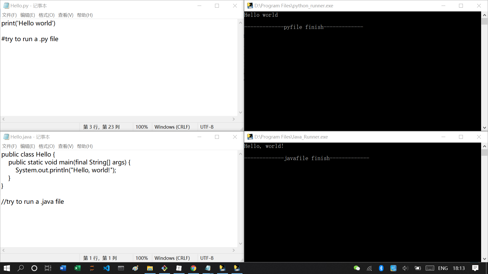

# Easy Code Runner

This is a set of very simple little programs written with python.

If you want to run your code with a default configuration by only double-clicking the file, try this.

.png)

### Notice:

1. You should have the right environment on your system.
2. Wanting to run codes with simply two clicks, you should first set the default program of your code files as its code runner.
3. Now, only python, java and C(C++) with [mingw64](http://www.mingw-w64.org/doku.php) supported.
4. Besides on windows, never tested on other systems yet.
